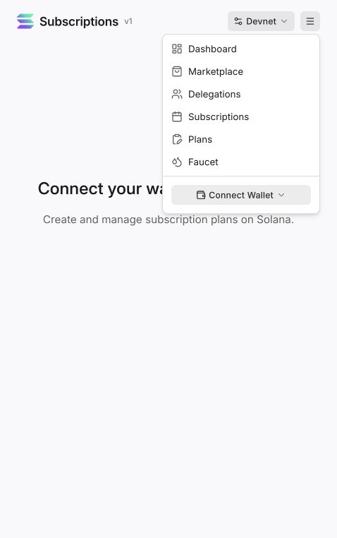

# Get paid in NEIRO, on a schedule

**Want to charge $10 a month for your community, app or service—and let people pay in NEIRO? This guide shows you how.**

Your customer approves a payment allowance in their wallet. When a bill is due, your app collects the NEIRO payment. They do not need to open their wallet and approve every bill.

You can keep the **dollar price** the same, or keep the **NEIRO amount** the same. Start with what you want to offer:

| What do you want to charge? | Follow this example |
| --- | --- |
| **“My membership costs $10 a month.”** | [Charge $10, paid in the current amount of NEIRO](docs/walkthrough.md) |
| **“Membership costs 1,000 NEIRO each month.”** | [Keep the NEIRO amount fixed](docs/more-ways-to-charge.md#charge-the-same-neiro-amount-every-time) |
| **“I want a weekly pass or a longer membership.”** | [Choose another dollar price and schedule](docs/more-ways-to-charge.md#choose-another-price-or-schedule) |
| **“Customers pay for what they use.”** | [Charge $0.25 per use](docs/more-ways-to-charge.md#charge-for-usage) |
| **“Customers approve a budget I can collect in parts.”** | [Use a limited NEIRO allowance](docs/more-ways-to-charge.md#collect-from-a-limited-budget) |
| **“I want a NEIRO plan people can subscribe to.”** | [Create a subscription plan](docs/more-ways-to-charge.md#create-a-plan-people-can-subscribe-to) |

## See the screens, then try your own example

[](docs/portal-tour.md)

*The official demo's menu, before connecting a wallet. [Take the screenshot tour →](docs/portal-tour.md)*

**[Follow the $10 tutorial](docs/walkthrough.md)** · **[Copy an agent prompt](docs/agent-prompts.md)** · **[See small code examples](docs/code-examples.md)**

### Want an agent to show you right now?

Copy this:

```text
Use https://github.com/bropump/solana-neiro-subscriptions.
Read README.md and AGENTS.md. Run the monthly-usd example in Surfpool.
Show me how $10 collects 20,000 NEIRO at one price and 10,000 at another.
Explain the customer's approval and show the confirmed balance changes.
Keep all transfers local; no real wallet or funds.
```

## What happens to a $10 subscription when NEIRO's price changes?

Imagine someone joins your community. Your price is $10 per billing period.

| When the bill is due | Example NEIRO price | Customer pays | You receive |
| --- | ---: | ---: | ---: |
| First period | $0.0005 | 20,000 NEIRO | 20,000 NEIRO |
| Next period | $0.001 | 10,000 NEIRO | 10,000 NEIRO |

**Same $10 bill. A different NEIRO amount each time.** Your app gets a fresh conversion when collecting each bill, using [NeiroPay's price service](https://price.neiropay.app/llms.txt). These table prices are illustrative.

You receive NEIRO directly. Its dollar value can change after you receive it. In these examples, a “month” is **30 days**.

## What does the customer agree to?

For the $10 example, they approve a maximum NEIRO allowance per period—say, 50,000 NEIRO. Your app charges the quoted amount for $10 within that allowance. If $10 would require more than the allowance, the payment is skipped; the customer would need to approve a higher limit to continue at that price.

The customer can revoke the permission to stop future collections. The Solana program enforces the NEIRO allowance; your billing app is responsible for charging the agreed dollar price only once per bill. The customer therefore trusts your collector within the approved allowance.

## See it happen yourself

[**Follow the $10 membership tutorial →**](docs/walkthrough.md)

It takes you from the customer's approval through two payments at different prices, then shows you how to reproduce them locally. The examples use **Surfpool**, which runs Solana locally, so you can try them without a funded wallet or real payments.

Prefer to explore the underlying wallet flow first? Open the [**official Solana subscriptions demo**](https://solana-subscriptions-program.vercel.app/). It demonstrates the base subscriptions program; the dollar-priced NEIRO example is explained and tested here.

## Has this actually been tested?

Yes. The recorded Surfpool run includes **16 confirmed NEIRO transfers** across the examples, including a payment calculated from a live NeiroPay quote. It checks that balances change correctly, payments respect allowances, and the collector can collect without a new customer signature. It also checks price changes, expired quotes, duplicate invoices and cancellation rules.

The tests use the real NEIRO mint and deployed Solana subscriptions program copied into a local test network. Test wallets, balances and time are simulated. [See the results](evidence/summary.json) or [inspect the transaction proof](evidence/proof.json).

## Ready to put this in your own app?

This is a working tutorial with runnable examples. To serve real customers, connect your wallet signup, a scheduled billing worker and payment storage. [The integration guide](docs/setup-checklist.md) explains that next step.

- **Building it yourself?** Start with the [tutorial](docs/walkthrough.md), then the [code reference](docs/developer-reference.md).
- **Asking an agent to build it?** Give it this repository and [the agent instructions](AGENTS.md).
- **Want to understand the protocol?** Read the [Solana subscriptions documentation](https://solana.com/docs/payments/subscriptions/overview).

These examples use the existing Solana subscriptions protocol without modifying it.

NEIRO BROPUMP mint: `CTg3ZgYx79zrE1MteDVkmkcGniiFrK1hJ6yiabropump` · 6 decimals.

MIT licensed. Examples maintained by bropump.
