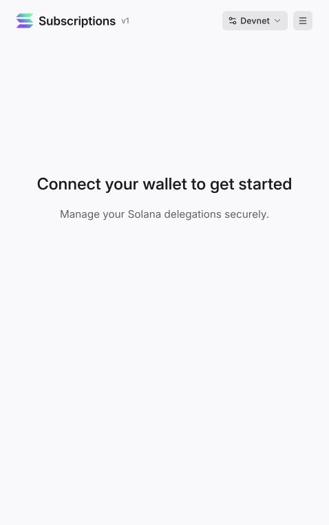

# Look around the Solana subscriptions demo

[← Back to the guide](../README.md)

Open the [official Solana subscriptions demo](https://solana-subscriptions-program.vercel.app/). This is the base protocol's demonstration app. Our NEIRO recipes show how to build on that protocol, including adding dollar pricing.

## 1. Start here

The network selector at the top says **Devnet**. The page asks you to connect a wallet before managing delegations. A delegation is simply permission for a collector to spend tokens within limits you approve.

The real NEIRO mint used in this guide is on mainnet. Our Surfpool examples copy that mint into a local network for testing; they do not turn the portal's Devnet into a NEIRO test environment.

## 2. Open the navigation menu

The menu gives you the vocabulary used by the demo:

| Menu item | How it relates to this guide |
| --- | --- |
| Delegations | Customer permissions. Our variable $10 payment uses a recurring delegation. |
| Plans | Merchant offers with token amounts and periods. See our fixed NEIRO plan example. |
| Subscriptions | Customers' subscriptions to those plans. |
| Marketplace | The demo's entry point for exploring plans. |
| Connect Wallet | Entry point for your wallet connection. |

These are actual screenshots of the public portal, captured on September 28, 2026, without connecting a wallet. The connected account and payment screens are not shown. No customer account information is included.

## 3. Choose what to try next

**Want to see $10 turn into different NEIRO amounts?** Follow the [membership tutorial](walkthrough.md). Its local demo needs no wallet connection.

**Want to create your own app?** Copy a [build prompt](agent-prompts.md) and give it to your coding agent along with this repository.

**Want the SDK calls?** Use the [small code examples](code-examples.md), then the [developer reference](developer-reference.md).

The official portal illustrates the underlying protocol. It is not a hosted checkout for the custom $10 NEIRO membership described here.
